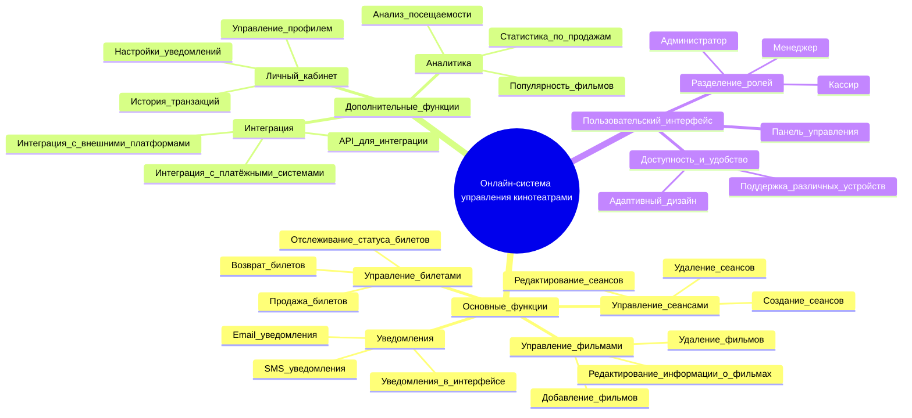
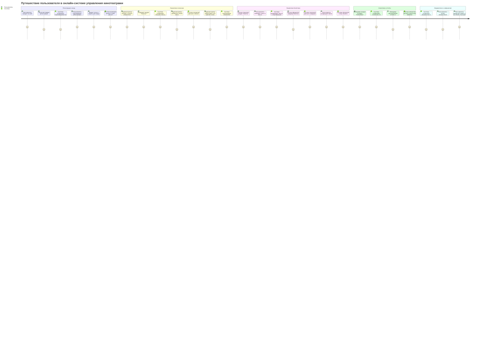
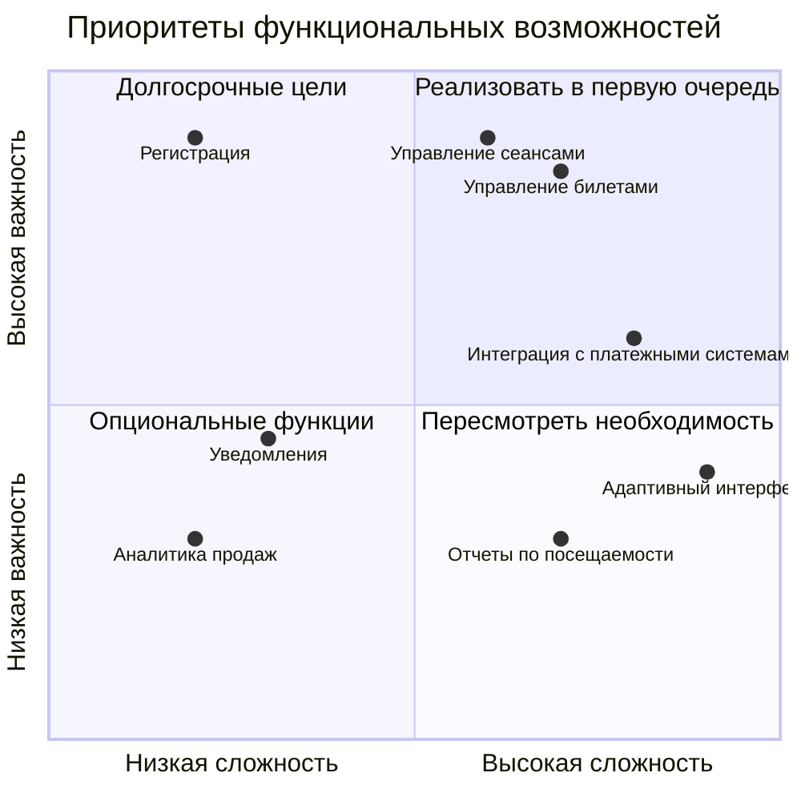
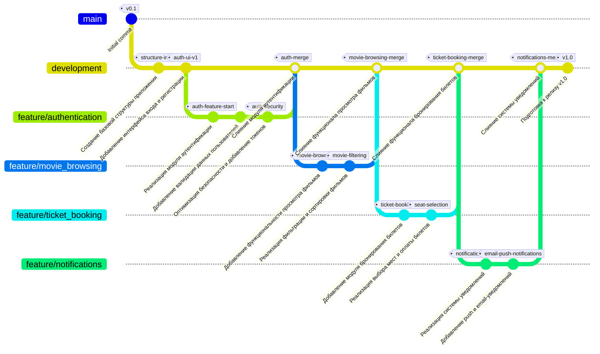

# PKSS_Mermaid
##Структура функциональных возможностей (Mind Map)

```mermaid
mindmap
  root((Онлайн-система управления кинотеатрами))
    Основные_функции
      Управление_сеансами
        Создание_сеансов
        Редактирование_сеансов
        Удаление_сеансов
      Управление_билетами
        Продажа_билетов
        Возврат_билетов
        Отслеживание_статуса_билетов
      Управление_фильмами
        Добавление_фильмов
        Редактирование_информации_о_фильмах
        Удаление_фильмов
      Уведомления
        Email_уведомления
        SMS_уведомления
        Уведомления_в_интерфейсе
    Дополнительные_функции
      Аналитика
        Статистика_по_продажам
        Анализ_посещаемости
        Популярность_фильмов
      Интеграция
        API_для_интеграции
        Интеграция_с_платёжными_системами
        Интеграция_с_внешними_платформами
      Личный_кабинет
        Управление_профилем
        История_транзакций
        Настройки_уведомлений
    Пользовательский_интерфейс
      Панель_управления
      Разделение_ролей
        Администратор
        Кассир
        Менеджер
      Доступность_и_удобство
        Адаптивный_дизайн
        Поддержка_различных_устройств
```
##Диаграмма путешествия пользователя (User Journey Diagram)

```mermaid
journey
    title Путешествие пользователя в онлайн-системе управления кинотеатрами
    section Регистрация и вход
      Пользователь заходит на сайт: 5: Пользователь
      Заполняет форму регистрации: 4: Пользователь
      Система отправляет подтверждение на email: 4: Система
      Пользователь подтверждает регистрацию: 5: Пользователь
      Вводит логин и пароль для входа: 5: Пользователь
      Система проверяет данные и дает доступ: 5: Система
    section Управление сеансами
      Администратор заходит в панель управления: 5: Пользователь
      Выбирает раздел "Сеансы": 5: Пользователь
      Система отображает текущие сеансы: 5: Система
      Администратор добавляет новый сеанс: 4: Пользователь
      Система сохраняет данные о сеансе: 5: Система
      Администратор редактирует или удаляет сеанс: 4: Пользователь
      Система подтверждает изменения: 5: Система
    section Управление билетами
      Кассир открывает раздел "Билеты": 5: Пользователь
      Пользователь выбирает сеанс и места: 5: Пользователь
      Система резервирует места и подтверждает заказ: 5: Система
      Кассир оформляет продажу билетов: 4: Пользователь
      Система сохраняет данные о продаже: 5: Система
      Пользователь возвращает билет: 5: Пользователь
      Система обновляет статус билета: 5: Система
    section Аналитика и отчеты
      Менеджер заходит в раздел "Аналитика": 5: Пользователь
      Система отображает статистику по продажам и посещаемости: 5: Система
      Менеджер просматривает отчеты о популярных фильмах: 4: Пользователь
      Система обновляет данные в реальном времени: 5: Система
    section Уведомления и завершение
      Система отправляет уведомления о новых фильмах и акциях: 4: Система
      Пользователь читает уведомления: 4: Пользователь
      Пользователь завершает работу с системой и выходит: 5: Пользователь

```
##Квадрант-граф

```mermaid
quadrantChart
    title Приоритеты функциональных возможностей
    x-axis "Низкая сложность" --> "Высокая сложность"
    y-axis "Низкая важность" --> "Высокая важность"
    quadrant-1 "Реализовать в первую очередь"
    quadrant-2 "Долгосрочные цели"
    quadrant-3 "Опциональные функции"
    quadrant-4 "Пересмотреть необходимость"
    "Регистрация": [0.2, 0.9]
    "Управление сеансами": [0.6, 0.9]
    "Управление билетами": [0.7, 0.85]
    "Уведомления": [0.3, 0.45]
    "Аналитика продаж": [0.2, 0.3]
    "Интеграция с платежными системами": [0.8, 0.6]
    "Адаптивный интерфейс": [0.9, 0.4]
    "Отчеты по посещаемости": [0.7, 0.3]

```
##Гит граф (Gitgraph)

```mermaid
gitGraph
    commit id: "Initial commit" tag: "v0.1"
    branch development
    commit id: "Создание базовой структуры приложения" tag: "structure-initial"
    commit id: "Добавление интерфейса входа и регистрации" tag: "auth-ui-v1"

    branch feature/authentication
    commit id: "Реализация модуля аутентификации" tag: "auth-feature-start"
    commit id: "Добавление валидации данных пользователей"
    commit id: "Оптимизация безопасности и добавление токенов" tag: "auth-security"
    checkout development

    merge feature/authentication id: "Слияние модуля аутентификации" tag: "auth-merge"

    branch feature/movie_browsing
    commit id: "Добавление функциональности просмотра фильмов" tag: "movie-browsing-start"
    commit id: "Реализация фильтрации и сортировки фильмов" tag: "movie-filtering"
    checkout development

    merge feature/movie_browsing id: "Слияние функционала просмотра фильмов" tag: "movie-browsing-merge"

    branch feature/ticket_booking
    commit id: "Добавление модуля бронирования билетов" tag: "ticket-booking-start"
    commit id: "Реализация выбора мест и оплаты билетов" tag: "seat-selection"
    checkout development

    merge feature/ticket_booking id: "Слияние функционала бронирования билетов" tag: "ticket-booking-merge"

    branch feature/notifications
    commit id: "Реализация системы уведомлений" tag: "notifications-feature-start"
    commit id: "Добавление push и email-уведомлений" tag: "email-push-notifications"
    checkout development

    merge feature/notifications id: "Слияние системы уведомлений" tag: "notifications-merge"

    commit id: "Подготовка к релизу v1.0" tag: "v1.0"

```
